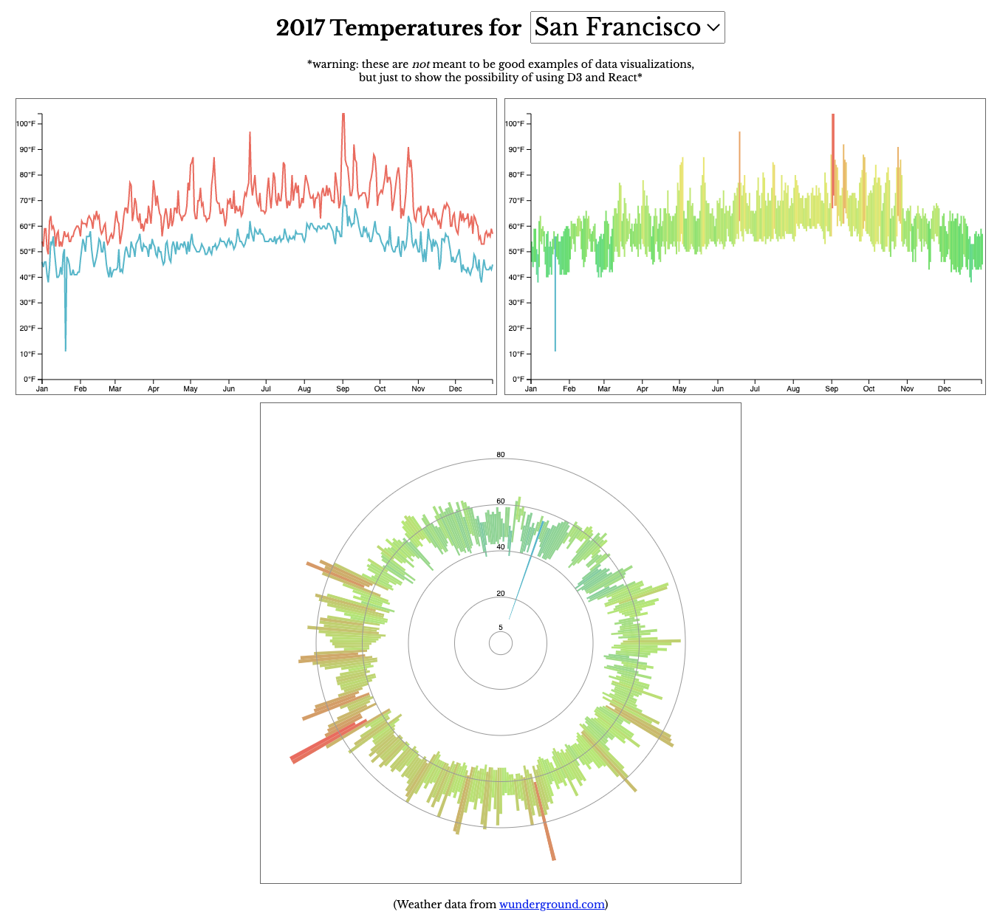

## React D3 Example with Hooks

Forked from https://github.com/sxywu/react-d3-example.git after seeing the talk in this video:
 
https://youtu.be/zXBdNDnqV2Q

Goals:
- Class components and lifecycle methods to functional components and hooks.
- JavaScript to TypeScript
- Learning D3

Run with `npm start`.

